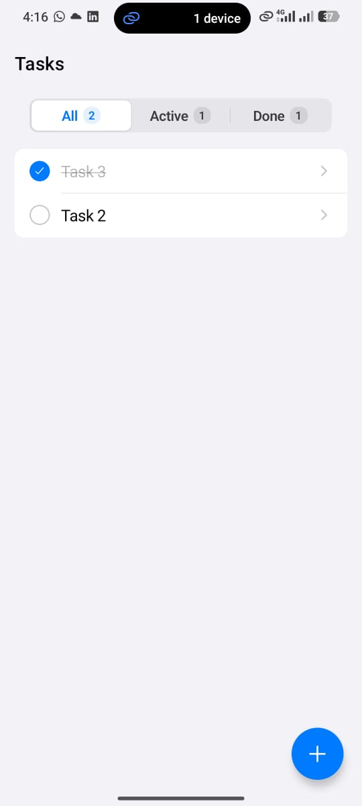
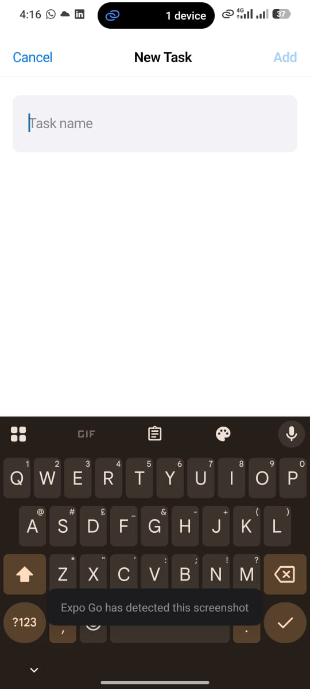
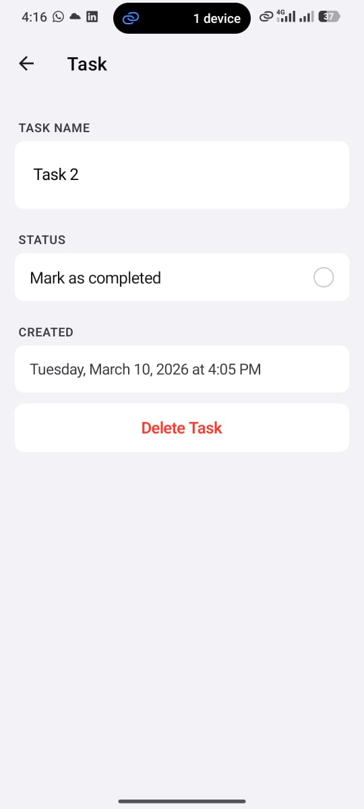

# Task Tracker

A clean, minimal task management app built with React Native (Expo) and TypeScript, following Apple Human Interface Guidelines.

## Screenshots





## Setup Instructions

### Prerequisites
- [Node.js](https://nodejs.org/) (v18 or higher)
- [Expo Go](https://expo.dev/client) on your iOS or Android device **or** an iOS/Android simulator

### Running the app

```bash
# 1. Install dependencies
npm install

# 2. Start the dev server
npx expo start
```

Scan the QR code with **Expo Go** (iOS/Android) or press `i` for iOS simulator / `a` for Android emulator.

## Project Structure

```
app/
  _layout.tsx          # Root Stack navigator + TaskProvider wrapper
  index.tsx            # Screen 1: Task List
  add-task.tsx         # Screen 2: Add Task (modal sheet)
  task/[id].tsx        # Screen 3: Task Detail / Edit

components/
  TaskRow.tsx          # Animated task row with checkbox
  FilterBar.tsx        # Segmented control (All / Active / Done)
  EmptyState.tsx       # Context-aware empty state
  FAB.tsx              # Floating action button

context/
  TaskContext.tsx      # Global context — shares task state across all screens

hooks/
  useTasks.ts          # All business logic: CRUD, filter, AsyncStorage persistence

lib/
  storage.ts           # AsyncStorage read/write helpers

types/
  task.ts              # Task and FilterType definitions

constants/
  theme.ts             # Apple HIG color tokens, typography scale, layout constants
```

## Libraries & Why

| Library | Reason |
|---------|--------|
| `expo-router` | File-system based navigation; ships with the Expo SDK — no extra config |
| `@react-native-async-storage/async-storage` | Simple local persistence for React Native |
| `expo-haptics` | Native haptic feedback on task toggle & validation errors — essential for Apple feel |
| `react-native-reanimated` | Smooth animated checkbox transitions |
| `@expo/vector-icons` (Ionicons) | SF Symbols–adjacent icon set; works cross-platform without a custom font |

No Redux, Zustand, or other state libraries were used. A single `useTasks` hook + React Context is what i used for this project.

## What I Would Improve With More Time

1. **Swipe-to-delete** — add `react-native-gesture-handler` swipeable rows on the list screen for faster task removal without opening the detail view.
2. **Drag-to-reorder** — allow users to manually order tasks with a long-press drag gesture.
3. **Due dates & reminders** — attach a due date to tasks and schedule local push notifications via `expo-notifications`.
4. **Dark mode** — the theme already uses semantic iOS color names; wiring `useColorScheme()` to flip the palette would take minimal effort.
5. **Accessibility** — add `accessibilityLabel`, `accessibilityHint`, and `accessibilityState` to all interactive elements for full VoiceOver / TalkBack support.
6. **Optimistic UI + error handling** — surface AsyncStorage write failures to the user instead of silently swallowing them.
7. **Unit tests** — add Jest + Testing Library tests for `useTasks` hook logic and the validation path in `add-task.tsx`.
